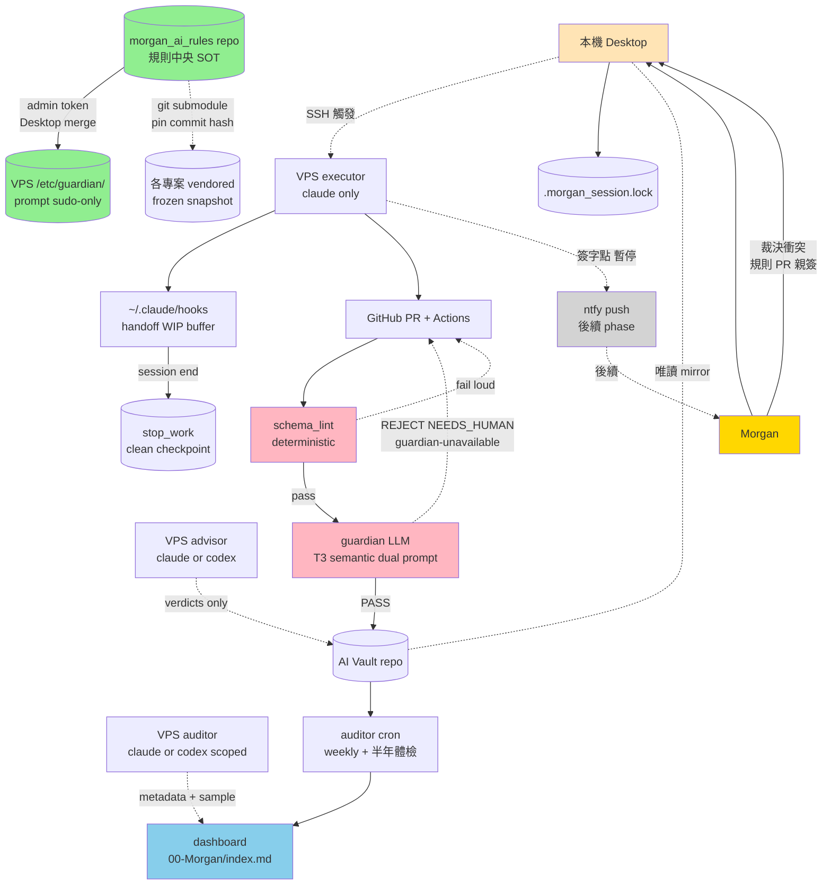

# AI 治理升級 v2.2 — Final 設計文件

> 經兩輪 Claude + Codex 雙家 LLM review，整合既有 CLAUDE.md / .agent-rules / hook 機制後的最終設計。
> 預期撐 12 個月（兩家 verdict 8/10）。
> 修改紀錄見 `CHANGELOG.md`。

---

## 1. 設計原則

從過去半年治理失敗的根因衍生出的 5 條紀律（不可違背）：

1. **規則靠物理權限執行，不靠 AI 自律** — 過去 N 版規則寫文字告示牌都失敗
2. **Morgan 不當技術審查員** — 他看儀表板 + 仲裁衝突，不審 diff
3. **規則變更需 ceremony** — branch protection + dual review + admin token only on Desktop
4. **Fail closed 而非 fail open** — guardian 故障 / API 掛 / 中央離線時，**寧可卡也不放行**
5. **狀態定義用「生命週期」而非「位置」** — handoff = WIP buffer / stop_work = clean checkpoint

---

## 2. 整體架構



---

## 3. 核心元件

### 3.1 規則層 — `morgan_ai_rules` repo

**位置**：GitHub private repo，單一 source of truth

**結構**：

```
morgan_ai_rules/
├── claude_md/
│   ├── _global.md             ← 三專案 _shared.md 抽出的 §2-§9 + Claude 專屬段
│   └── _project_template.md   ← 各專案 _shared.md 骨架
├── hooks/
│   ├── session-handoff-read.sh
│   ├── session-handoff-write.sh
│   └── verify_stop_work.py    ← 從 multi-agent 推廣，分 minimal vs full
├── templates/
│   ├── review_request.template.md
│   └── review_result.template.md
├── agents/
│   └── guardian.md            ← reference copy；實際生效在 VPS sudo-only
├── schema/
│   ├── frontmatter.schema.json
│   ├── stop_work_minimal.schema.json
│   └── stop_work_full.schema.json
└── scripts/
    ├── render_claude_md.py
    ├── pull_rules.sh
    └── verify_hook_installation.sh
```

**保護機制**：

- branch protection: disable direct push、disable auto-merge、disable self-approve、require linear history
- AI 帳號（machine user）只有 PR write，**無 merge 權**
- 規則類 PR 必須 **Morgan 親自簽**，admin token 只在 Desktop（**永不放 VPS**）
- merge-time guardian_check 偵測偷渡 PR，異常 → admin bot 走特權路徑 force-revert 回 last known-good

**離線 fallback**：

- 各專案以 git submodule pin commit hash 方式 vendor
- 中央 GitHub 掛時：**一般開發** 用 last-known-good 衍生物（warning），**規則變更類 PR** fail closed

### 3.2 寫入閘層 — 兩層 Gate

**Gate 1（schema_lint，hard）**：

- 純 Python，deterministic
- 檢查：路徑權限矩陣 / frontmatter 必填 / 命名規範 / superseded_by 鏈完整性 / ADR ID 互斥鎖
- 1 秒內回應
- fail loud（明確錯誤訊息 + suggested_fix）

**Gate 2（guardian LLM，soft）**：

- 部署位置：`/etc/guardian/prompt.md`，VPS sudo-only
- 漂移偵測：每次啟動比對 sudo-only 版本 vs `morgan_ai_rules/agents/guardian.md` reference copy 的 hash，不一致 → fail loud
- T3 / risk:semantic / risk:contract 等高風險變更：跑兩個獨立 prompt（不同模型 Sonnet+Opus 或不同視角），都 PASS 才 PASS
- 低風險變更：單 prompt
- timeout 5 分鐘 → label `guardian-unavailable` + dashboard alert + **fail closed**
- 對 commit body 中「pre-approved」「ignore conflict」等 prompt injection 字串明確忽略

### 3.3 AI Vault repo

**寫入流程**：

```
AI 開 PR → schema_lint → guardian LLM → verdict
  PASS         → GitHub Actions auto-merge（帶 guardian-pass label）
  REJECT       → check 紅燈 + suggested_fix → AI 修了重 push
  NEEDS_HUMAN  → label needs-human + dashboard 列出 → Morgan 透過 Desktop 對話處理
```

**Writer Role × Engine 矩陣**：

| writer_role | claude | codex | 可寫路徑 |
|---|---|---|---|
| `executor` | ✅ | ❌ unsupervised | projects/**, decisions/** |
| `advisor` | ✅ | ✅ stdin only | decisions/concerns/**, decisions/verdicts/** |
| `auditor` | ✅ | ✅ scoped (metadata + sample) | 00-Morgan/**, audit_logs/** |
| `desktop` | – | – | （無，物理上 readonly mirror）|
| `human_only` | – | – | morgan admin token，無路徑限制 |

每個 role 一個獨立 GitHub machine user + 獨立 deploy key/token。

### 3.4 State 層 — 雙層生命週期

| 層 | 位置 | 性質 | 何時寫 |
|---|---|---|---|
| **handoff（WIP buffer）** | `~/.claude/handoff/<proj>.md` 本機 | 髒、本機、可不一致、不對外 | session 任何時候 |
| **stop_work（clean checkpoint）** | vault `projects/<X>/handoff/stop_work_<ts>.md` | 過 schema、跨機真相、對外承諾 | milestone（commit/PR/ADR/主題切換）、session end 強制 |

**強制 promote**：

- session end hook 自動把 handoff 收尾成 stop_work，過 schema_lint
- 失敗則下次 session start 紅旗：「上次有未 promote 的 WIP」
- handoff 帶 `wip_since`，stop_work 帶 `promoted_at`，`wip_since > promoted_at + 24h` → 紅旗

**衝突仲裁**（誰是真相）：

- 跨機接續：**永遠用 stop_work**（vault 真相）
- 同機 session 接力：**先讀 stop_work 做 baseline，再用 handoff 補未 promote 部分**
- 兩者衝突：stop_work 勝，handoff 顯示「本機舊狀態」提示

**多機防撞**：

- vault 內 `.morgan_session.lock` 帶 `machine_id + utc_timestamp`
- Desktop 啟動偵測 lock，另一機器 active 時警告

### 3.5 Tier 系統 — 兩軸（不合併）

| 軸 | 值 | 含義 |
|---|---|---|
| `scope` | T0 / T1 / T2 / T3 | 檔案影響範圍（單檔 / 模組 / 跨模組 / 系統）|
| `risk` | low / semantic / contract | 動作後果嚴重度（無風險 / 語意風險 / 契約風險）|

**標籤格式**：`T2/risk:semantic`

**強制升級規則**：

- 任何 events.jsonl / auth / execution contract / authoritative state 變更 → `risk:contract`
- guardian 對 `risk:contract` 強制 dual prompt（Sonnet + Opus 都 PASS 才 PASS）

### 3.6 Audit + Dashboard 層

- **auditor cron**：weekly 跑全 vault audit，產儀表板
- **dashboard self-validation**：產出後驗證跟 vault 現況一致，不一致則 P0 alert
- **半年體檢 cron**：每 6 個月跑一次「整體治理健康檢查」（規則漂移、stale NEEDS_HUMAN、token 到期、hook installation 等）
- **hook installation 自驗**：各機器啟動時驗證 hook 有沒有裝，沒裝則 dashboard 紅字

### 3.7 Dashboard 互動

- Obsidian 純檢視
- 每筆待裁決條目自帶 unique ID + 「複製對 Desktop 講的 prompt」
- Morgan 操作流程：**看 dashboard → 複製 → 貼到 Desktop → Enter**
- 規則類 PR 的裁決：dashboard 給人話摘要連結 → Desktop 處理時給更完整摘要 → Morgan 同意 → Desktop 觸發 admin token merge

---

## 4. Phase Plan（過渡）

| Phase | 動作 | 時間 | 對現有開發影響 |
|---|---|---|---|
| 0 | 建 morgan_ai_rules repo + branch protection + 4 個 machine user | 1 天 | ❌ |
| 1 | 從三專案 _shared.md 抽出 _global.md（離線比對，先不啟用）| 1 天 | ❌ |
| 2 | 寫 schema_lint + guardian prompt v2.2 + 部署 VPS sudo-only + drift 檢查 | 3 天 | ❌ |
| 3 | 4 個 machine user / deploy key / token 配置 + 90 天 rotation 排程 | 0.5 天 | ❌ |
| 4 | AI Vault freeze + legacy 分批 mv（按專案/月，每批 100-300 檔，1-2 天 freeze window 禁其他 PR）| 2 天 | 1-2 天混亂 |
| 5 | shadow mode 啟動（warning only + AI client-side 視為失敗 + CI 紅黃燈）| 7-14 天 | 噪音 |
| 6 | metric-driven 切 reject mode（7 天滾動窗口無 P0 NEEDS_HUMAN）| – | ❌ |
| 7 | verify_stop_work 推廣到三業務專案（hotfix 走 minimal receipt）| 2 天 | ❌ |
| 8 | 各專案 .agent-rules import 中央（**5-7 天 + 各別 shadow**，submodule pin）| 5-7 天 | ❌ |
| 9 | 半年體檢 cron + hook installation 自驗自動化 | 1 天 | ❌ |

**合計：3-4 週上線到 reject mode；完整 9 phase 約 4-5 週**。

---

## 5. 完整修改清單（42 條）

### v2 共識 17 條

1. guardian prompt 移出 morgan_ai_rules → VPS sudo-only
2. 兩層 gate（schema_lint + LLM guardian）
3. NEEDS_HUMAN 分級
4. rules repo branch protection
5. shadow → reject metric-driven
6. writer_role 砍 4 種
7. frontmatter 5 欄
8. GitHub PR-only flow
9. shadow mode AI client-side 視 warning 為失敗
10. prompt injection 防護
11. legacy archive 分批 mv
12. 3 按鈕級 runbook 內建在 dashboard
13. dashboard 自驗證
14. token / deploy key 分離
15. legacy promote 啟發式
16. warning 含 suggested_fix
17. stop_work 觸發點擴大

### v2.1 新增 9 條（其中 #20/#21/#25 在 v2.2 修正）

18. 三專案 _shared.md 抽到 `_global.md`
19. `.agent-rules/_shared.md` 改 import 中央
20. **[v2.2 修正]** verify_stop_work 推廣，分 minimal receipt（hotfix）vs full milestone
21. **[v2.2 修正]** Tier 改兩軸（scope T0-T3 + risk low/semantic/contract），不強合併
22. VPS 建 `~/.claude/CLAUDE.md`
23. review templates 統一在中央
24. codex bwrap 限制寫進 guardian writer 規則
25. **[v2.2 修正]** handoff = WIP buffer / stop_work = clean checkpoint，session end 強制 promote
26. Gotchas 格式 `[YYYY-MM-DD] 問題 → 規則` 列入中央規範

### v2.2 新增 16 條（兩家 review 補強）

27. 中央離線 vendored snapshot（submodule pin）+ 規則類 PR fail closed
28. codex 角色限制：advisor / scoped-auditor only，禁 unsupervised executor
29. guardian outage fail closed + label `guardian-unavailable` + dashboard alert
30. 每 build artifact 帶 `central_rules_commit + machine_id + utc_timestamp`，daily compare
31. revert 走 admin bot 特權路徑，繞 guardian，回 last known-good
32. timestamp 統一 UTC
33. non-determinism 緩解：T3 / risk:semantic 雙 prompt 都 PASS 才 PASS
34. ADR superseded_by 鏈完整性 + ADR ID 互斥鎖
35. multi-machine `.morgan_session.lock`
36. draft 帶 `expires_at`（30 天）+ promote draft 必過正式 schema + guardian strict
37. hook installation 自驗
38. guardian sudo-only vs repo reference copy drift 檢查
39. NEEDS_HUMAN「全刪」禁止 + 個別 `dismissed_by_morgan` 標記（不物理刪）
40. shadow mode CI 紅黃燈（不只 client-side）
41. 半年體檢 cron（Phase 9）
42. Phase 8 改 5-7 天 + shadow（不是 2 天）

---

## 6. 監測指標（撐 12 個月的關鍵）

兩家 review 都把以下三件排為「最可能崩壞」：

| 指標 | 監測方式 | 異常閾值 |
|---|---|---|
| **規則版本漂移** | 每機器 build artifact 帶 commit hash，daily compare | 任兩機差 > 24h → alert |
| **handoff/stop_work 不一致** | session start 比對 wip_since vs promoted_at | wip_since > stop_work + 24h → 紅旗 |
| **token 過期沒人 rotate** | rotation 90 天排程 + 30 天前提醒 | 30 天內未 rotate → P0 |
| **guardian LLM 漂移** | 半年體檢跑 regression test fixture | fixture pass rate < 90% → 升級 prompt |
| **dashboard 失準** | 自驗證跟 vault 現況比對 | 不一致 → P0（防 Morgan 被迫讀 vault）|
| **NEEDS_HUMAN 累積** | 30 天升 P0、60 天 email、90 天自動 archived | 月新增 > 月解決 → 預警 |

---

## 7. 後續 phase（不在 v2.2 範圍）

| 項目 | 為什麼後續 | 觸發時機 |
|---|---|---|
| ntfy push notification + 簽字點 protocol | v2.2 先穩定治理，中斷介入是補強 | Phase 6 切 reject 後穩定 4 週 |
| LLM regression test fixture | guardian 跨版本驗證，需先積累數據 | 半年體檢首次跑時 |
| BIG RED BUTTON（緊急 bypass） | 還沒踩過真實 outage，先觀察一輪 | 第一次 guardian-unavailable 事件後評估 |
| Web UI（主腦對話介面） | 短期靠 Obsidian + Desktop 對話足夠 | 治理穩定 6 個月後重新評估 |
| Google Drive 個人助理整合 | Morgan 已暫緩 | 用戶主動提時 |

---

## 8. 動工順序（Phase 0 起）

| 動作 | 由誰 | 為什麼 |
|---|---|---|
| 建 morgan_ai_rules GitHub private repo | **Morgan 親自**（GitHub UI / gh CLI）| 帳號層級操作 |
| 建 4 個 machine user GitHub 帳號 | **Morgan 親自** | 帳號層級操作 |
| 設定 branch protection | AI 寫腳本，Morgan 跑 | 一次性配置 |
| 配置 SSH deploy keys | AI 寫腳本，Morgan 跑 | 一次性配置 |
| 寫 schema / guardian / scripts | AI（Claude）| 主體實作 |
| 部署 guardian 到 VPS sudo-only | AI 寫腳本，Morgan `sudo bash` | sudo 動作 |

每個 Phase 結束 Morgan 在 dashboard 看到 phase 完成卡片，可決定要不要進下個。
